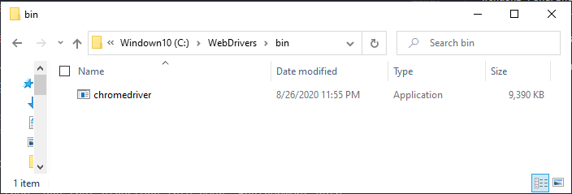
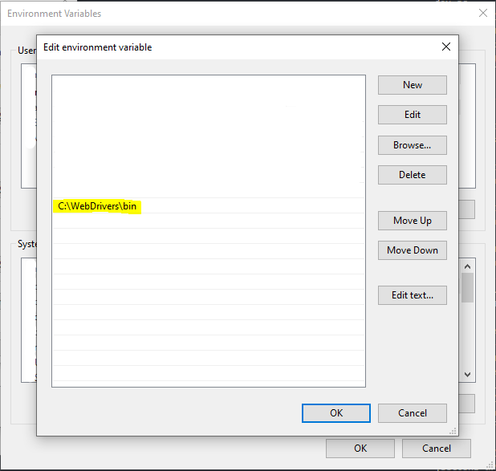

# Selenium Test

# Setup Chrome Driver (Windows 10)

- Download Chrome Driver via [link](https://sites.google.com/a/chromium.org/chromedriver/downloads)

  > Warning: Download the driver version that match with your browser version

- Place `chromedriver.exe` into `C:WebDrivers\bin\` directory.

- And then, add the directory to your PATH.

## Running Test

Run `node index.js` to start testing.
